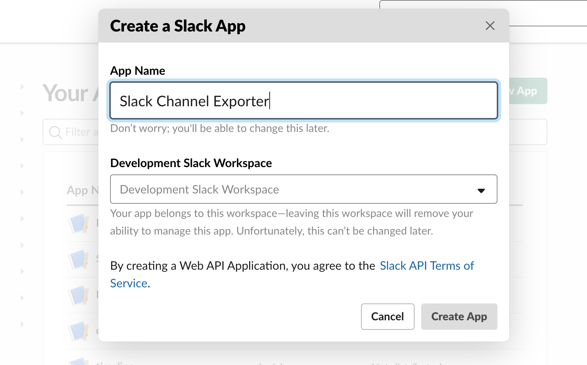
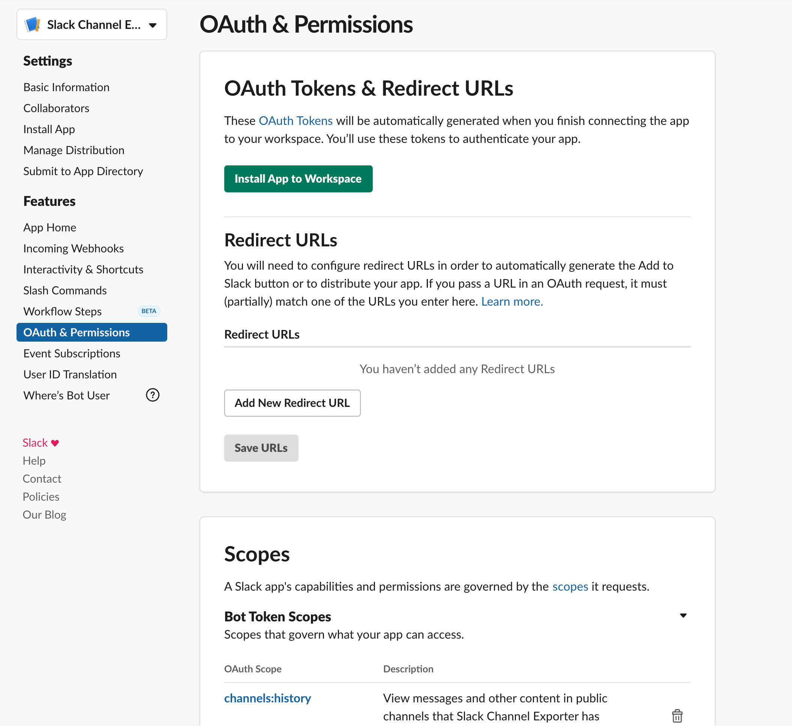
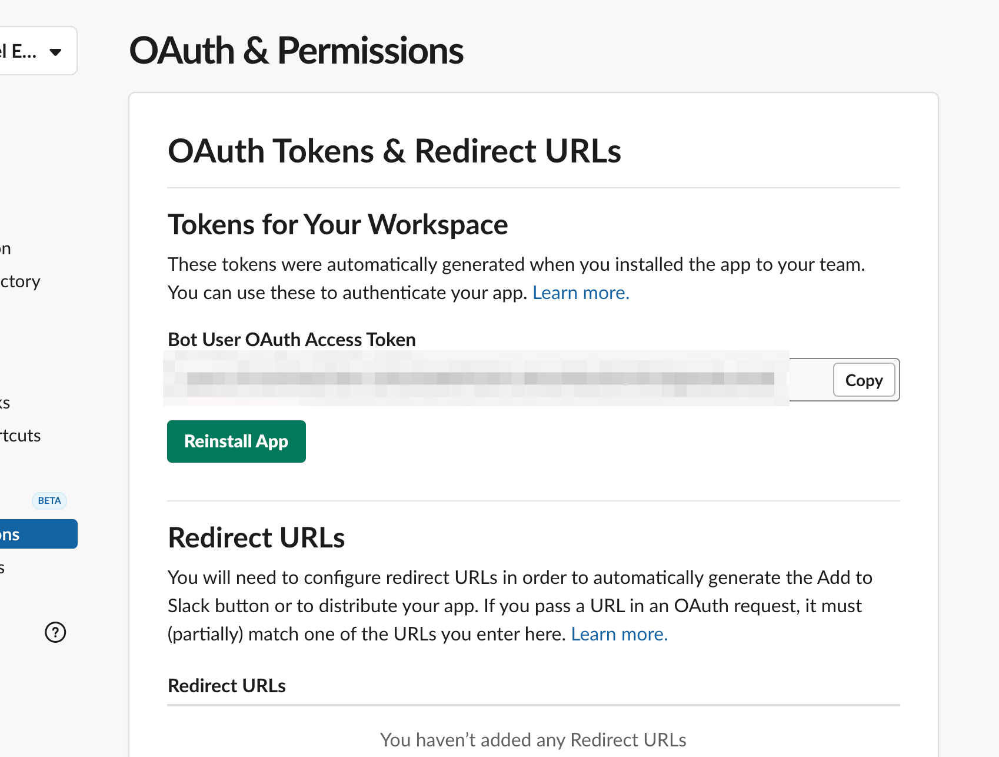
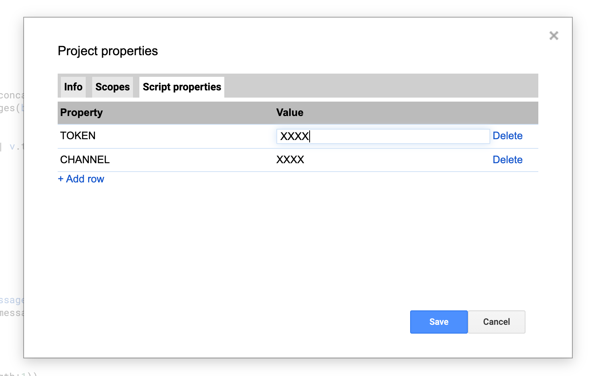
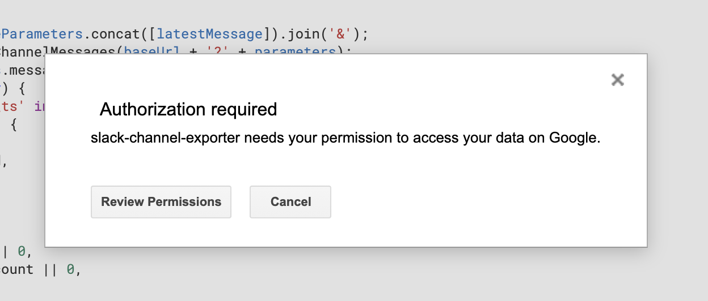
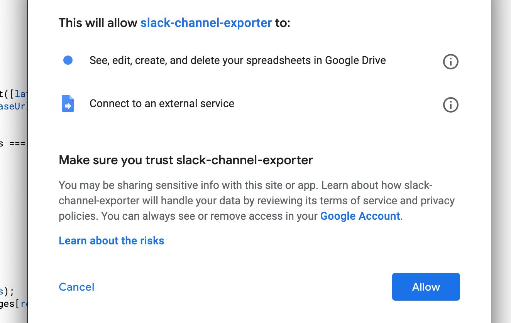

## About

Slack の特定のチャネルのメッセージを Spreadsheet に Export する Google Apps Script 用プロジェクトです。

## Environment

- Google Apps Script (Installable triggers with Google Spreadsheet)

## Installation

### 1. Slack App を作成し 対象のワークスペースにインストールする

#### 1-1. Slack App を作成

- [Slack API: Applications | Slack](https://api.slack.com/apps) を開く
- "Create New App" を選択
  - "App Name: Slack Channel Exporter" (任意) を設定
  - "Development Slack Workspace: <対象の Workspace>" を選択
  - "Create App" で作成



#### 1-2. 作成した Slack App にチャンネルのメッセージ履歴を読む権限を追加する

- Add features and functionality > Permissions を選択
- Scopes > Bot Token Scopes > Add an OAuth Scope を選択
  - 対象のチャンネルが public channel の場合は `channels:history` を追加
  - 対象のチャンネルが private channel の場合は `groups:history` を追加

#### 1-3. 権限追加した Slack App を 対象の Slack ワークスペースにインストールする

- OAuth & Permissions > OAuth Tokens & Redirect URLs > Install App to Workspace を選択



- Allow を選択

#### 1-4. インストールした Slack App の Token を取得する

- OAuth Tokens & Redirect URLs > Tokens for Your Workspace > Bot User OAuth Access Token > copy を選択



#### 1-5. 作成した Slack App を 対象の Slack チャンネルに招待する

- 対象のチャンネルで以下の Slash コマンドを実行 (Slack App 名を "Slack Channel Exporter" に設定した場合)

```text
/invite @Slack Channel Exporter
```

### 2. 対象の Slack Channel ID を取得する

- 対象の Slack Workspace をブラウザで開く
- 下記の `CHANNEL_ID` の部分を取得する

```text
https://app.slack.com/client/${TEAM_ID}/${CHANNEL_ID}
```

### 3. 公開している Google Sheets の雛形をコピーする

- スプレッドシートを開く https://docs.google.com/spreadsheets/d/1wU9oej5iQqNpF729qR_nHSdU8d1GIRL568DKeEZkAAc/edit?usp=sharing
- ファイル > コピーを作成

### 4. スクリプトのプロパティに環境変数を設定する

- ツール > スクリプトエディタ ( Google Apps Script エディタが開く) 
- ファイル > プロジェクトのプロパティ
- スクリプトのプロパティ > 行を追加
  - TOKEN: Slack API トークン (1-5 で取得したもの)
  - CHANNEL: Slack channel ID (2 で取得したもの)
- 保存 



### 5. スクリプトを実行する

- (任意) もし必要であれば スクリプトを修正し 取得するチャンネル履歴の件数制限を更新する (デフォルトは 1000件に設定)

```diff
  const baseParameters = [
    'token=' + TOKEN,
    'channel=' + CHANNEL,
-    'count=1000',
+    'count=2000',
  ];
```

- 関数を選択
  - main 関数を選択
- 実行ボタン ▶ を選択
- 対象の Google Sheets に書き込むために Authorization が求められるので "Review permissions" を選択



- 使用する Google Account を選択
- Allow を選択



- スプレッドシートにデータ反映されていれば OK
